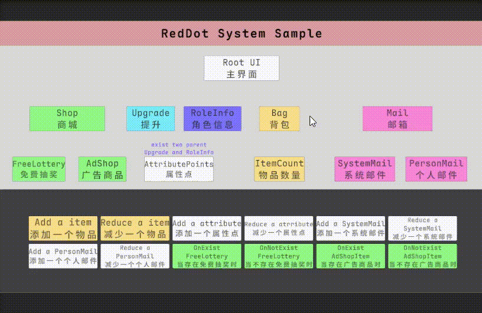
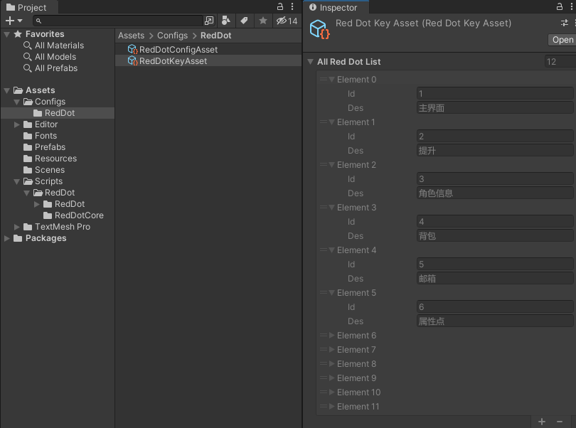
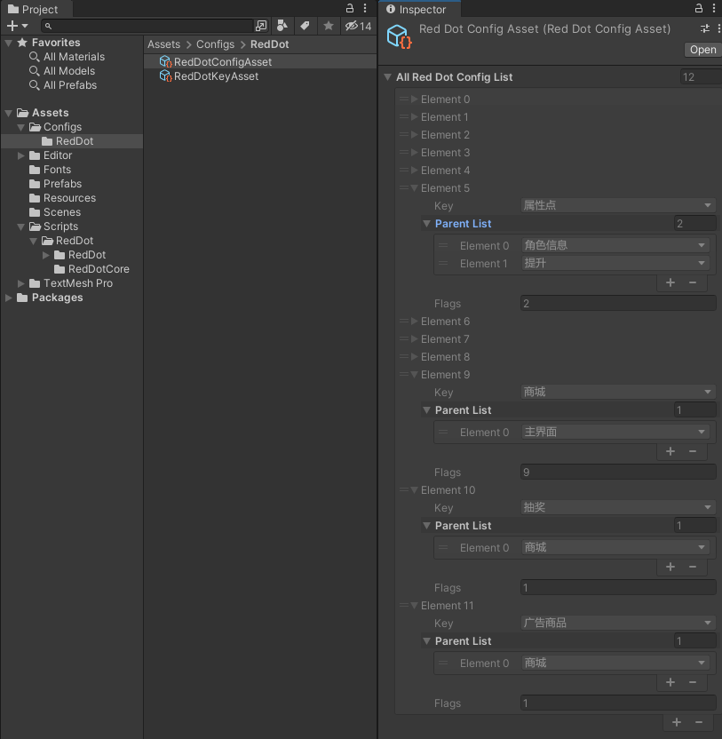
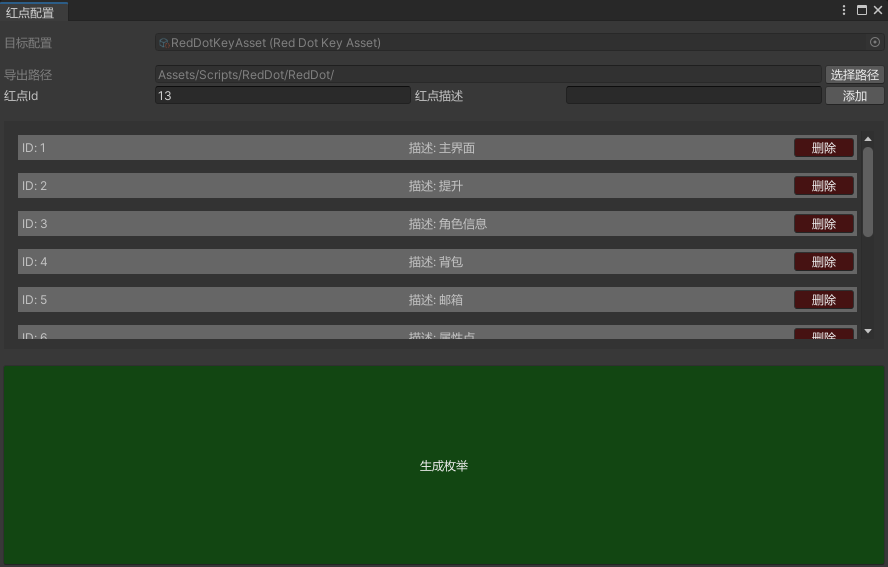
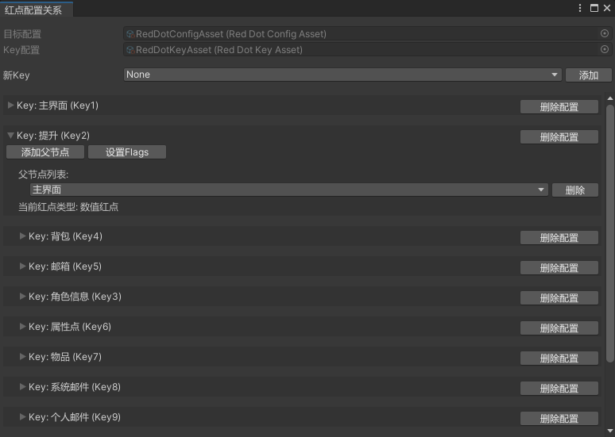
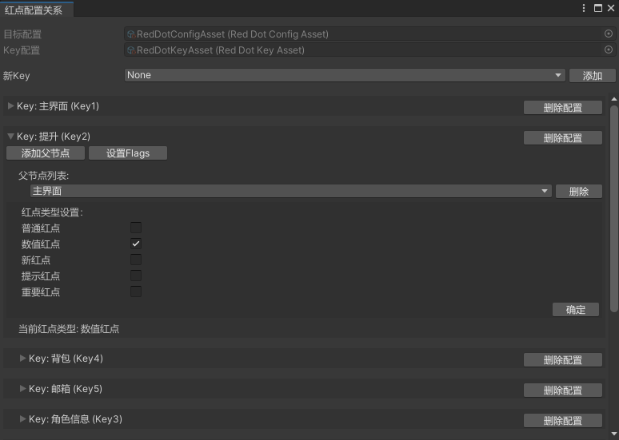
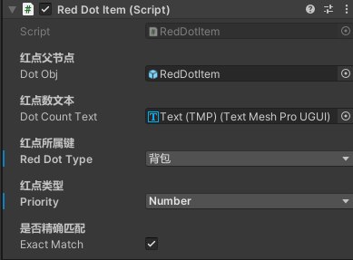

<div align="center">
    <h1>🔴 RedDotSystem</h1>
    <p>A lightweight, highly extensible red dot notification system developed for Unity</p>
    <p><a href="README.md">中文文档</a></p>
</div>

<div align="center">

[](LICENSE)

<p align="center">



</p>
</div>

## ✨ Features

### 🎯 Diverse Red Dot Types
- **Standard Red Dot** - Regular notification
- **Numeric Red Dot** - Displays specific quantities
- **New Feature Red Dot** - Special style notification
- **Tip Red Dot** - Light reminder
- **Important Red Dot** - Highlighted display

### 🌲 Tree Node Management
- **Hierarchical Structure** - Supports multiple parent-child node relationships
- **State Propagation** - Automatic upward state transmission
- **Flexible Configuration** - Supports diverse node settings

### 🛠 Developer Friendly
- **Simple API** - Easy to understand and use
- **Example Scenes** - Complete demo project
- **Visual Tools** - Convenient configuration interface

## 📁 Project Structure

```plaintext
Assets/
├── Configs/        # Configuration files
│   └── RedDot/     # Red dot system configs
├── Editor/         # Editor extension tools
│   └── RedDot/     # Red dot configuration tools
├── Prefabs/        # Prefab resources
│   ├── RedDotItem.prefab          # Basic red dot
│   ├── RedDotItem_Free.prefab     # Free label
│   └── RedDotItem_New.prefab      # New feature label
├── Resources/      # Resource files
├── Scenes/         # Example scenes
└── Scripts/        # Core code
    └── RedDot/     # Red dot system implementation
```

## 🚀 Installation

### 📦 Method 1: Using Unity Package

1. Go to [Releases](https://github.com/qqw1584913629/RedDotSystem/releases) page
2. Download the latest version of `RedDotSystem.unitypackage`
3. Import the file into your Unity project:
   - Double-click the downloaded file
   - Or select Assets > Import Package > Custom Package in Unity

### ⚡ Method 2: Clone the Project

```bash
# Clone repository
git clone https://github.com/qqw1584913629/RedDotSystem.git

# Or using SSH
git clone git@github.com:qqw1584913629/RedDotSystem.git
```

After opening the project in Unity Hub, check out the example scene:
> 📂 Assets/Scenes/RedDotSampleScene.unity

## 🔧 Configuration Guide

### Red Dot Type Configuration
Configure basic red dot information through `RedDotKeyAsset`:
| Parameter | Description |
|------|------|
| id   | Unique identifier for the red dot |
| des  | Red dot description |

<p align="center">
    
</p>

### Red Dot Relationship Configuration
Configure parent-child relationships and display types through `RedDotConfigAsset`:
| Parameter | Description |
|------|------|
| key  | Corresponds to id in RedDotKeyAsset |
| parentList | List of parent nodes |
| flags | Red dot display type (Default/Number/New/Tips/Important) |

<p align="center">
    
</p>

## 🔨 Editor Tools

### RedDotKey Editor
> Path: Tool/RedDot/RedDotKey Editor
- Configure red dot basic information
- Automatically generate red dot enum definitions

<p align="center">
    
</p>

### RedDotConfig Editor
> Path: Tool/RedDot/RedDotConfig Editor
- Visual configuration of red dot relationships
<p align="center">
    
</p>
<p align="center">
    
</p>

## 📝 Usage Example
> No need to manually initialize each red dot, just set the quantity when needed.
```csharp
// Initialize red dot information
public class RedDotSingleton : MonoBehaviour
{
    private static RedDotSingleton _instance;
    public static RedDotSingleton Instance => _instance;
    public delegate void OnRdCountChange(RedDotNode node);
    public Dictionary<ERedDotKeyType, RedDotNode> AllRedDotNodes = new Dictionary<ERedDotKeyType, RedDotNode>();
    public RedDotConfigAsset _config;
    public void Awake()
    { 
        if (_instance == null)
            _instance = this;
        // TODO Load according to your project's resource management
        // _config = Resources.Load<RedDotConfigAsset>(nameof(RedDotConfigAsset));
        InitRedDotTreeNode();
    }
    public void InitRedDotTreeNode()
    {
        // Create all nodes
        foreach (var config in _config.AllRedDotConfigList)
        {
            if (!AllRedDotNodes.ContainsKey(config.key))
            {
                var node = new RedDotNode { rdType = config.key };
                AllRedDotNodes.Add(config.key, node);
            }
        }

        // Establish parent-child relationships
        foreach (var config in _config.AllRedDotConfigList)
        {
            var node = AllRedDotNodes[config.key];
            foreach (var parentKey in config.parentList)
            {
                if (AllRedDotNodes.TryGetValue(parentKey, out var parentNode))
                {
                    node.parents.Add(parentNode);
                    parentNode.rdChildrenDic[config.key] = node;
                }
            }
        }
    }
    //...remaining code
}
```
> During development, only maintain the number of red dots, and ignore the rest.
```csharp
// Set a standard red dot
RedDotSingleton.Instance.Set(ERedDotKeyType.Key1, 1, RedDotFlags.Default);

// Set a numeric red dot
RedDotSingleton.Instance.Set(ERedDotKeyType.Key1, 1, RedDotFlags.Number);
```

> 💡 Tip: RedDotItem.cs automatically sets up red dot event subscriptions in its Start method. Just attach it to objects that need to display red dots.
<p align="center">
    
</p>

## ⚠️ Important Notes
1. Avoid circular references in red dot configurations
2. Plan red dot hierarchy structure reasonably, avoid excessive depth
3. Clean up unused red dot configurations
4. Regularly maintain and update red dot states

## 📋 Development Plan
- [x] To be determined
<!-- - [ ] Add more red dot styles
- [ ] Optimize red dot update performance
- [ ] Support red dot condition configuration
- [ ] Add red dot statistics analysis -->

## 🔤 Font
This project uses [Maple Font](https://github.com/subframe7536/maple-font). This is an open-source monospaced programming font with rounded corners, ligatures, and console icons.