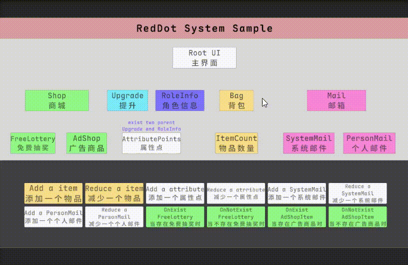
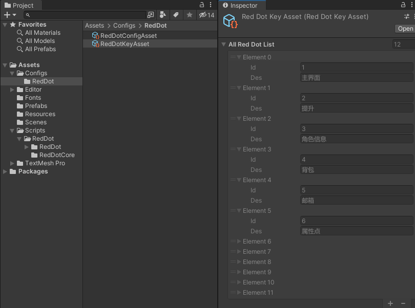
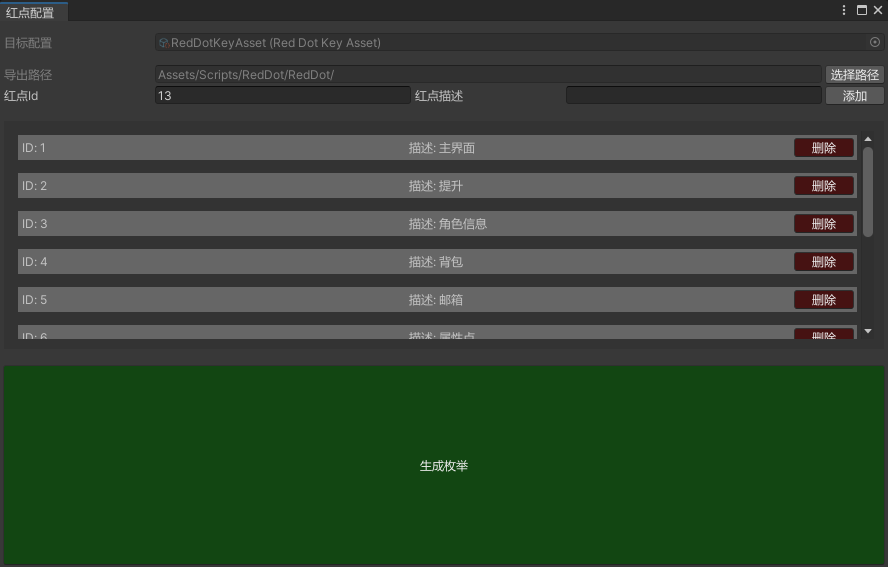
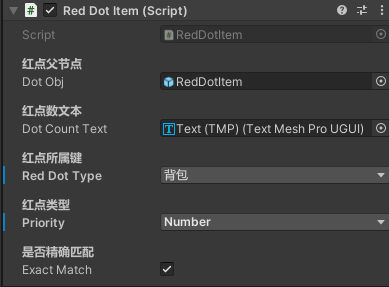

<div align="center">
    <h1>🔴 RedDotSystem</h1>
    <h2>红点提示系统</h2>
    <p>一个基于 Unity 开发的轻量级、高扩展性的红点提示系统</p>
    <p><a href="README-EN.md">English Document</a></p>
</div>


<div align="center">

[](LICENSE)

<p align="center">



</p>
</div>

## ✨ 特性

### 🎯 多样化的红点类型
- **普通红点** - 常规提示
- **数值红点** - 显示具体数量
- **新功能红点** - 特殊样式提示
- **提示红点** - 轻量提醒
- **重要红点** - 突出显示

### 🌲 树形节点管理
- **层级结构** - 支持多父子节点关系
- **状态传递** - 自动向上传递状态
- **灵活配置** - 支持多样化节点设置

### 🛠 开发友好
- **简单 API** - 易于理解和使用
- **示例场景** - 完整的演示项目
- **可视化工具** - 便捷的配置界面

## 📁 项目结构

```plaintext
Assets/
├── Configs/        # 配置文件
│   └── RedDot/     # 红点系统配置
├── Editor/         # 编辑器扩展工具
│   └── RedDot/     # 红点配置工具
├── Prefabs/        # 预制体资源
│   ├── RedDotItem.prefab          # 基础红点
│   ├── RedDotItem_Free.prefab     # 免费标签
│   └── RedDotItem_New.prefab      # 新功能标签
├── Resources/      # 资源文件
├── Scenes/         # 示例场景
└── Scripts/        # 核心代码
    └── RedDot/     # 红点系统实现
```
## 🚀 安装步骤

### 📦 方式一：使用 Unity Package

1. 前往 [Releases](https://github.com/qqw1584913629/RedDotSystem/releases) 页面下载
2. 选择最新版本的 `RedDotSystem.unitypackage`
3. 将文件导入您的 Unity 项目中：
   - 双击下载的文件
   - 或在 Unity 中选择 Assets > Import Package > Custom Package

### ⚡ 方式二：克隆项目

```bash
# 克隆仓库
git clone https://github.com/qqw1584913629/RedDotSystem.git

# 或使用 SSH
git clone git@github.com:qqw1584913629/RedDotSystem.git
```

在 Unity Hub 中打开项目后，查看示例场景：
> 📂 Assets/Scenes/RedDotSampleScene.unity


## 🔧 配置说明

### 红点类型配置
通过 `RedDotKeyAsset` 配置红点的基础信息：
| 参数 | 说明 |
|------|------|
| id   | 红点唯一标识 |
| des  | 红点描述说明 |

<p align="center">
    
</p>

### 红点关系配置
通过 `RedDotConfigAsset` 配置红点的父子关系和显示类型：
| 参数 | 说明 |
|------|------|
| key  | 对应 RedDotKeyAsset 中的 id |
| parentList | 父节点列表 |
| flags | 红点显示类型（Default/Number/New/Tips/Important）|

<p align="center">
    
</p>

## 🔨 编辑器工具

### RedDotKey Editor
> 路径：Tool/RedDot/RedDotKey Editor
- 配置红点基础信息
- 自动生成红点枚举定义

<p align="center">
    
</p>

### RedDotConfig Editor
> 路径：Tool/RedDot/RedDotConfig Editor
- 可视化配置红点关系
<p align="center">
    
</p>
<p align="center">
    
</p>

## 📝 使用示例
> 无需每个红点都要手动初始化，只需要在需要的时候设置数量即可。
```csharp
// 初始化红点信息
public class RedDotSingleton : MonoBehaviour
{
    private static RedDotSingleton _instance;
    public static RedDotSingleton Instance => _instance;
    public delegate void OnRdCountChange(RedDotNode node);
    public Dictionary<ERedDotKeyType, RedDotNode> AllRedDotNodes = new Dictionary<ERedDotKeyType, RedDotNode>();
    public RedDotConfigAsset _config;
    public void Awake()
    { 
        if (_instance == null)
            _instance = this;
        // TODO 根据自己项目的资源管理进行加载就好 这里演示直接Inspector拖动了
        // _config = Resources.Load<RedDotConfigAsset>(nameof(RedDotConfigAsset));
        InitRedDotTreeNode();
    }
    public void InitRedDotTreeNode()
    {
        // 创建所有节点
        foreach (var config in _config.AllRedDotConfigList)
        {
            if (!AllRedDotNodes.ContainsKey(config.key))
            {
                var node = new RedDotNode { rdType = config.key };
                AllRedDotNodes.Add(config.key, node);
            }
        }

        // 建立父子关系
        foreach (var config in _config.AllRedDotConfigList)
        {
            var node = AllRedDotNodes[config.key];
            foreach (var parentKey in config.parentList)
            {
                if (AllRedDotNodes.TryGetValue(parentKey, out var parentNode))
                {
                    node.parents.Add(parentNode);
                    parentNode.rdChildrenDic[config.key] = node;
                }
            }
        }
    }
    //...其余代码
}
```
> 开发过程中，只需要维护红点的数量即可，其他的不需要关注。
```csharp
// 设置一个普通红点
RedDotSingleton.Instance.Set(ERedDotKeyType.Key1, 1, RedDotFlags.Default);

// 设置一个数值红点
RedDotSingleton.Instance.Set(ERedDotKeyType.Key1, 1, RedDotFlags.Number);
```

> 💡 提示：RedDotItem.cs 会在 Start 方法中自动设置订阅红点的事件，只需将其挂载在需要显示红点的物体上即可。
<p align="center">
    
</p>

## ⚠️ 注意事项
1. 避免红点配置中的循环引用
2. 合理规划红点层级结构，避免层级过深
3. 及时清理不需要的红点配置
4. 定期维护和更新红点状态

## 📋 开发计划
- [x] 想到再说
<!-- - [ ] 添加更多红点样式
- [ ] 优化红点更新性能
- [ ] 支持红点条件配置
- [ ] 添加红点统计分析 -->

## 🔤 字体
本项目使用 [Maple Font](https://github.com/subframe7536/maple-font) 字体。这是一款开源的等宽编程字体,具有圆角、连字和控制台图标等特性。
